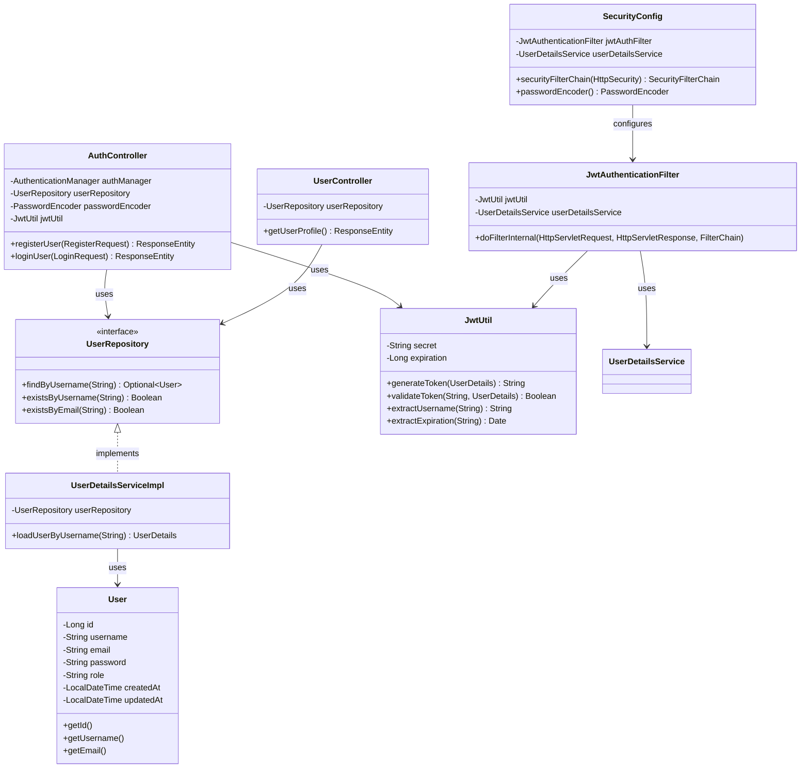
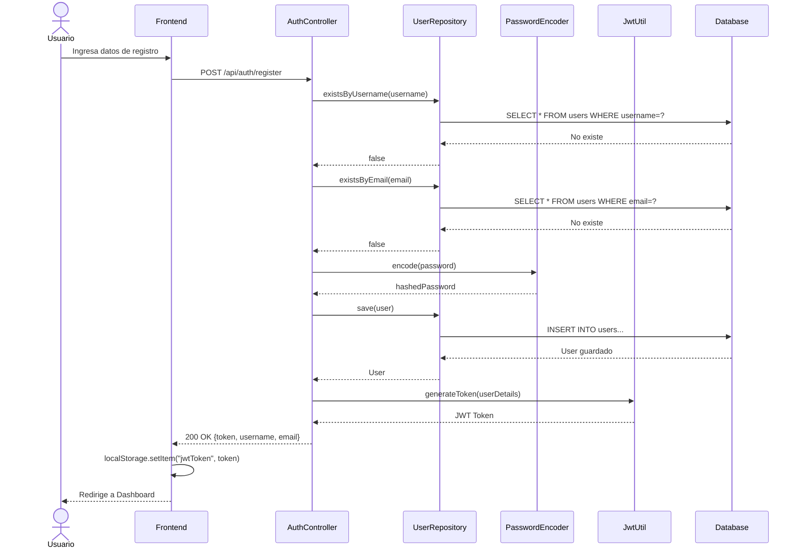
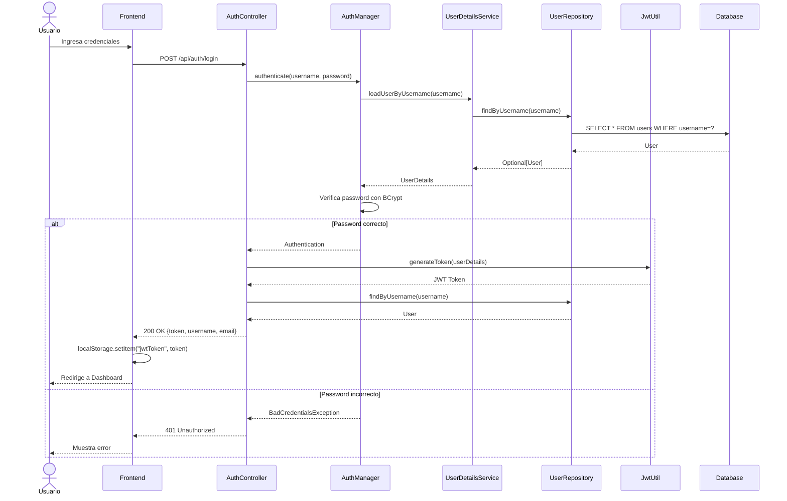
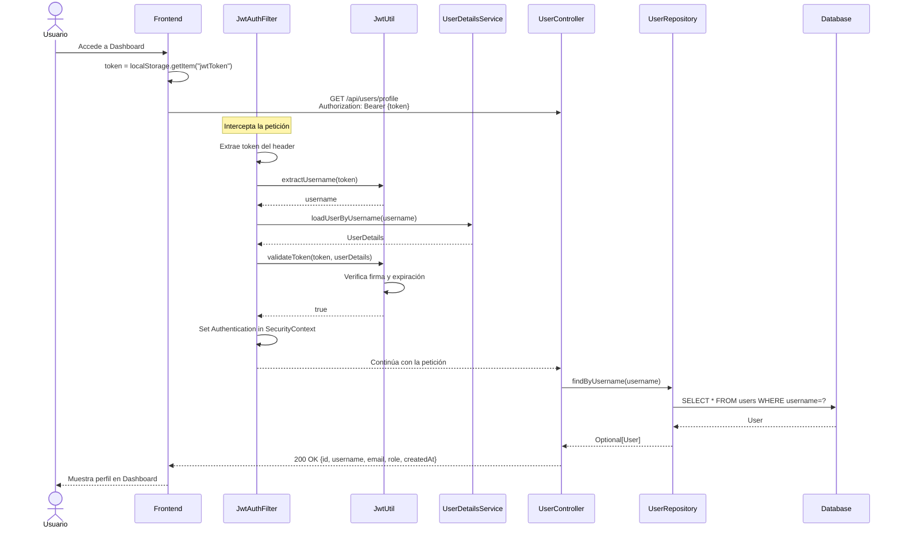
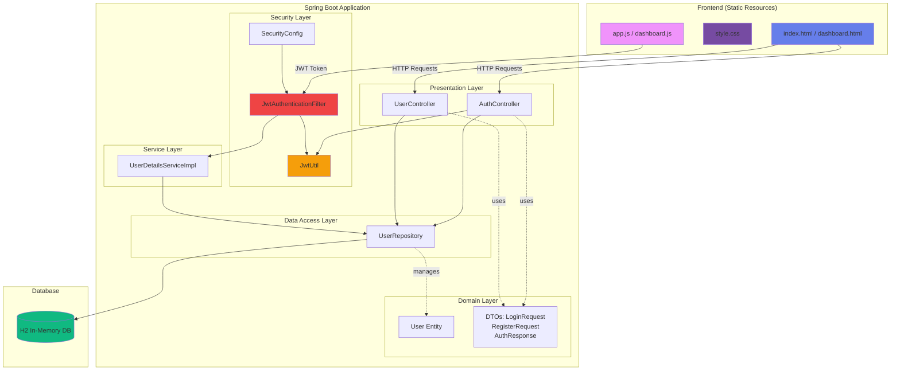

# 🔐 Spring Boot JWT Authentication Sample

Una aplicación completa de ejemplo que demuestra la autenticación JWT con Spring Boot y un frontend moderno y llamativo.

## ✨ Características

- 🔒 **Autenticación JWT segura** - Tokens basados en estándares de la industria
- 🎨 **Frontend moderno** - Diseño glassmorphism con gradientes vibrantes
- 🚀 **Spring Boot 3** - Framework moderno con Spring Security 6
- 💾 **Base de datos H2** - Base de datos en memoria para desarrollo rápido
- 📱 **Diseño responsive** - Funciona en cualquier dispositivo
- ✅ **Validación completa** - Validación de formularios y manejo de errores

## 🛠️ Tecnologías Utilizadas

### Backend
- Spring Boot 3.2.1
- Spring Security 6
- Spring Data JPA
- JWT (jjwt 0.12.3)
- H2 Database
- Lombok
- Maven

### Frontend
- HTML5
- CSS3 (Glassmorphism, Gradientes, Animaciones)
- JavaScript (Vanilla)
- Google Fonts (Poppins)

## 📋 Requisitos Previos

- Java 17 o superior
- Maven 3.6 o superior

## 🚀 Cómo Ejecutar

1. **Clonar el repositorio** (si aplica):
   ```bash
   git clone <repository-url>
   cd spring-jwt-sample
   ```

2. **Compilar el proyecto**:
   ```bash
   mvn clean install
   ```

3. **Ejecutar la aplicación**:
   ```bash
   mvn spring-boot:run
   ```

4. **Acceder a la aplicación**:
   Abrir el navegador en: `http://localhost:8080`

## 📡 API Endpoints

### Autenticación

#### Registrar Usuario
```http
POST /api/auth/register
Content-Type: application/json

{
  "username": "usuario",
  "email": "usuario@email.com",
  "password": "password123"
}
```

**Respuesta exitosa:**
```json
{
  "token": "eyJhbGciOiJIUzI1NiIsInR5cCI6IkpXVCJ9...",
  "username": "usuario",
  "email": "usuario@email.com"
}
```

#### Iniciar Sesión
```http
POST /api/auth/login
Content-Type: application/json

{
  "username": "usuario",
  "password": "password123"
}
```

**Respuesta exitosa:**
```json
{
  "token": "eyJhbGciOiJIUzI1NiIsInR5cCI6IkpXVCJ9...",
  "username": "usuario",
  "email": "usuario@email.com"
}
```

### Endpoints Protegidos

#### Obtener Perfil de Usuario
```http
GET /api/users/profile
Authorization: Bearer {token}
```

**Respuesta exitosa:**
```json
{
  "id": 1,
  "username": "usuario",
  "email": "usuario@email.com",
  "role": "ROLE_USER",
  "createdAt": "2024-01-31T22:30:00"
}
```

## 🧪 Pruebas con Bruno (API Client)

### Instalación de Bruno
Si no tienes Bruno instalado, descárgalo desde: [usebruno.com](https://www.usebruno.com/)

### Colección Bruno Incluida

He creado una colección Bruno completa en la carpeta `bruno/` que puedes importar directamente:

```
bruno/
├── bruno.json                    # Configuración de la colección
├── environments/
│   └── Local.bru                 # Variables de entorno (baseUrl, token)
├── Auth/
│   ├── Register.bru              # Request de registro
│   └── Login.bru                 # Request de login
└── Users/
    └── Get Profile.bru           # Request de perfil (protegido)
```

### Importar la Colección en Bruno

1. Abre Bruno
2. Click en "Open Collection"
3. Navega a la carpeta `bruno/` del proyecto
4. La colección se cargará automáticamente

### Configuración de Variables de Entorno

La colección incluye un environment "Local" con:
- `baseUrl`: `http://localhost:8080`
- `token`: (se guarda automáticamente después de login/register)

### Scripts Automáticos

Los requests de **Login** y **Register** incluyen scripts que guardan automáticamente el token JWT:

```javascript
if (res.body.token) {
  bru.setEnvVar("token", res.body.token);
  console.log("✅ Token guardado:", res.body.token);
}
```

### Ejemplos de Uso

#### 1️⃣ Registrar Usuario

**Request**: `Auth > Register`

```http
POST {{baseUrl}}/api/auth/register
Content-Type: application/json

{
  "username": "alice",
  "email": "alice@example.com",
  "password": "password123"
}
```

**Respuesta** (200 OK):
```json
{
  "token": "eyJhbGciOiJIUzI1NiJ9...",
  "username": "alice",
  "email": "alice@example.com"
}
```

💡 El token se guarda automáticamente en la variable `{{token}}`

---

#### 2️⃣ Iniciar Sesión

**Request**: `Auth > Login`

```http
POST {{baseUrl}}/api/auth/login
Content-Type: application/json

{
  "username": "alice",
  "password": "password123"
}
```

**Respuesta** (200 OK):
```json
{
  "token": "eyJhbGciOiJIUzI1NiJ9...",
  "username": "alice",
  "email": "alice@example.com"
}
```

**Error** (401):
```json
{
  "message": "Credenciales inválidas"
}
```

---

#### 3️⃣ Obtener Perfil (Protegido)

**Request**: `Users > Get Profile`

```http
GET {{baseUrl}}/api/users/profile
Authorization: Bearer {{token}}
```

**Respuesta** (200 OK):
```json
{
  "id": 1,
  "username": "alice",
  "email": "alice@example.com",
  "role": "ROLE_USER",
  "createdAt": "2026-01-31T22:30:00"
}
```

**Sin Token** (403):
```json
{
  "timestamp": "2026-01-31T22:30:00.000+00:00",
  "status": 403,
  "error": "Forbidden",
  "path": "/api/users/profile"
}
```

---

### Tests Incluidos

Cada request incluye tests automatizados:

**Register/Login**:
```javascript
test("Status code is 200", function() {
  expect(res.status).to.equal(200);
});

test("Response has token", function() {
  expect(res.body.token).to.be.a('string');
});
```

**Get Profile**:
```javascript
test("Response has user data", function() {
  expect(res.body).to.have.property('username');
  expect(res.body).to.have.property('email');
  expect(res.body.role).to.equal('ROLE_USER');
});
```

### Flujo de Prueba Recomendado

1. **Iniciar el servidor**:
   ```bash
   mvn spring-boot:run
   ```

2. **Ejecutar requests en orden**:
   - ✅ `Auth > Register` → Obtén el token
   - ✅ `Users > Get Profile` → Verifica que funciona con el token
   - ✅ `Auth > Login` → Prueba con usuario existente
   - ✅ `Users > Get Profile` → Verifica con el nuevo token

### Casos de Prueba

| Caso | Request | Resultado Esperado |
|------|---------|-------------------|
| Registro exitoso | `POST /auth/register` | 200 + token |
| Usuario duplicado | `POST /auth/register` (mismo username) | 400 Bad Request |
| Login correcto | `POST /auth/login` | 200 + token |
| Login incorrecto | `POST /auth/login` (password malo) | 401 Unauthorized |
| Perfil con token | `GET /users/profile` + Bearer token | 200 + datos |
| Perfil sin token | `GET /users/profile` sin Auth header | 403 Forbidden |

---

## 🎯 Flujo de Autenticación JWT

1. **Registro/Login**: El usuario envía credenciales al backend
2. **Generación de Token**: El servidor valida las credenciales y genera un JWT
3. **Almacenamiento**: El frontend guarda el token en localStorage
4. **Autenticación**: Para cada petición a endpoints protegidos, el frontend incluye el token en el header `Authorization: Bearer {token}`
5. **Validación**: El servidor valida el token en cada petición
6. **Acceso**: Si el token es válido, se permite el acceso al recurso

## 📊 Diagramas UML

### Diagrama de Clases - Modelo de Dominio



### Diagrama de Secuencia - Registro de Usuario



### Diagrama de Secuencia - Login de Usuario



### Diagrama de Secuencia - Acceso a Endpoint Protegido



### Diagrama de Componentes - Arquitectura General



## 🗄️ Estructura del Proyecto

```
spring-jwt-sample/
├── src/
│   ├── main/
│   │   ├── java/com/example/jwt/
│   │   │   ├── config/          # Configuración de Spring Security y JWT
│   │   │   ├── controller/      # Controladores REST
│   │   │   ├── dto/             # Data Transfer Objects
│   │   │   ├── model/           # Entidades JPA
│   │   │   ├── repository/      # Repositorios JPA
│   │   │   ├── service/         # Servicios de negocio
│   │   │   ├── util/            # Utilidades JWT
│   │   │   └── SpringJwtApplication.java
│   │   └── resources/
│   │       ├── static/          # Frontend (HTML, CSS, JS)
│   │       └── application.properties
├── pom.xml
└── README.md
```

## 🎨 Características del Frontend

- **Glassmorphism**: Efectos de vidrio esmerilado modernos
- **Gradientes Vibrantes**: Colores púrpura, azul y rosa
- **Animaciones Suaves**: Transiciones y efectos hover
- **Formularios Tabbed**: Cambio fluido entre login y registro
- **Validación en Tiempo Real**: Retroalimentación inmediata al usuario
- **Diseño Responsive**: Adaptable a móviles y tablets

## 🔐 Seguridad

- Contraseñas encriptadas con BCrypt
- Tokens JWT firmados con HS256
- Validación de tokens en cada petición
- CORS configurado para peticiones cross-origin
- Sesiones stateless (sin estado en servidor)
- Expiración de tokens (24 horas por defecto)

## 🐛 Debugging

Para acceder a la consola H2 durante el desarrollo:
- URL: `http://localhost:8080/h2-console`
- JDBC URL: `jdbc:h2:mem:jwtdb`
- Username: `sa`
- Password: (dejar vacío)

## 📝 Configuración

Las propiedades principales se encuentran en `application.properties`:

- `jwt.secret`: Clave secreta para firmar tokens
- `jwt.expiration`: Tiempo de expiración del token en ms (86400000 = 24 horas)
- `server.port`: Puerto del servidor (8080 por defecto)

## 🤝 Contribuciones

Este es un proyecto de ejemplo educativo. Siéntete libre de usarlo como base para tus proyectos.

## 📄 Licencia

Este proyecto es de código abierto y está disponible bajo la licencia MIT.

---

**Desarrollado con ❤️ usando Spring Boot y JWT**

Prueba con JWT
